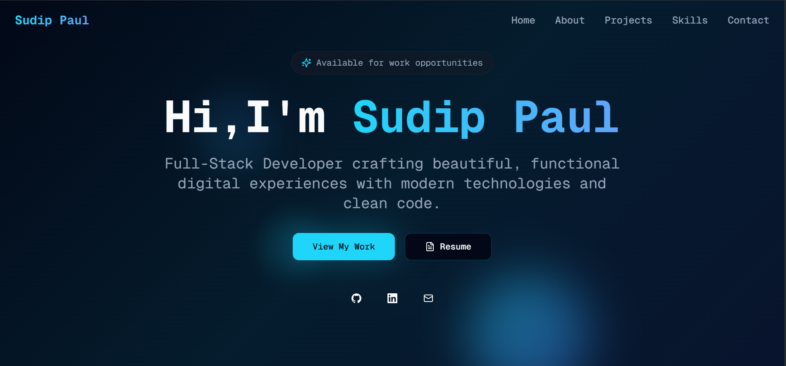

# 🚀 Portfolio Website

A modern, responsive portfolio website built with React (Frontend) and Node.js/Express (Backend) featuring a contact form with email functionality.



## ✨ Features

- **Modern UI/UX**: Built with React, TypeScript, and Tailwind CSS
- **Component Library**: Utilizes Radix UI and shadcn/ui components
- **Interactive Elements**: Custom dock navigation, icon clouds, and smooth animations
- **Contact Form**: Functional contact form with email integration
- **Responsive Design**: Mobile-first approach with responsive layouts
- **Email Service**: Backend API for sending emails via Gmail SMTP
- **Fast Development**: Vite for lightning-fast development experience

## 🛠️ Tech Stack

### Frontend
- **React 18** - UI Library
- **TypeScript** - Type Safety
- **Vite** - Build Tool & Dev Server
- **Tailwind CSS** - Styling
- **shadcn/ui** - UI Components
- **Radix UI** - Headless UI Components
- **Framer Motion** - Animations
- **React Hook Form** - Form Management

### Backend
- **Node.js** - Runtime Environment
- **Express.js** - Web Framework
- **Nodemailer** - Email Service
- **CORS** - Cross-Origin Resource Sharing
- **dotenv** - Environment Variables

## 📁 Project Structure

```
Portfolio of sudip/
├── client/                 # Frontend React Application
│   ├── src/
│   │   ├── components/     # React Components
│   │   │   ├── ui/        # shadcn/ui Components
│   │   │   └── magicui/   # Custom UI Components
│   │   ├── hooks/         # Custom React Hooks
│   │   ├── lib/           # Utility Functions
│   │   └── pages/         # Page Components
│   ├── public/            # Static Assets
│   └── package.json
├── server/                # Backend Express Application
│   ├── controllers/       # Route Controllers
│   ├── routes/           # API Routes
│   ├── middlewares/      # Custom Middlewares
│   └── package.json
└── README.md
```

## 🚀 Quick Start

### Prerequisites
- Node.js (v18 or higher)
- npm or yarn
- Gmail account (for email functionality)

### Installation

1. **Clone the repository**
   ```bash
   git clone https://github.com/Sudip-2/vibrant-creator-portal.git
   cd "Portfolio of sudip"
   ```

2. **Install Frontend Dependencies**
   ```bash
   cd client
   npm install
   ```

3. **Install Backend Dependencies**
   ```bash
   cd ../server
   npm install
   ```

4. **Environment Setup**
   
   Create a `.env` file in the `server` directory:
   ```env
   SMTP_USER=your-gmail@gmail.com
   SMTP_PASS=your-app-password
   ```
   
   > **Note**: Use Gmail App Password, not your regular password. Enable 2FA first.

### 🔧 Development

1. **Start the Backend Server**
   ```bash
   cd server
   node index.js
   ```
   Server will run on `http://localhost:8000`

2. **Start the Frontend Development Server**
   ```bash
   cd client
   npm run dev
   ```
   Frontend will run on `http://localhost:5173`

### 📧 Gmail Setup for Contact Form

1. Enable 2-Factor Authentication on your Gmail account
2. Go to Google Account Settings → Security → 2-Step Verification
3. Generate an "App Password" for the application
4. Use this App Password in your `.env` file

## 📋 Available Scripts

### Frontend (client/)
- `npm run dev` - Start development server
- `npm run build` - Build for production
- `npm run preview` - Preview production build
- `npm run lint` - Run ESLint

### Backend (server/)
- `node index.js` - Start the server
- `npm test` - Run tests (when implemented)

## 🎨 Components

The portfolio includes several custom components:

- **Hero** - Landing section with introduction
- **About** - About me section
- **Skills** - Technical skills showcase
- **Projects** - Portfolio projects display
- **Contact** - Contact form with email integration
- **Navigation** - Responsive navigation
- **CustomDock** - Interactive dock navigation
- **IconCloudCustom** - Animated icon cloud

## 📱 Responsive Design

The portfolio is fully responsive and optimized for:
- 📱 Mobile devices (320px+)
- 📟 Tablets (768px+)
- 💻 Desktops (1024px+)
- 🖥️ Large screens (1440px+)

## 🔗 API Endpoints

### POST `/api/mailSend`
Send email through contact form

**Request Body:**
```json
{
  "subject": "Contact Form Submission",
  "from": "John Doe",
  "email": "john@example.com",
  "text": "Hello, I'd like to get in touch..."
}
```

**Response:**
```json
{
  "success": true,
  "message": "Email sent successfully",
  "messageId": "<message-id>"
}
```

## 🚀 Deployment

### Frontend (Vercel/Netlify)
1. Build the project: `npm run build`
2. Deploy the `dist` folder

### Backend (Railway/Heroku)
1. Set environment variables in your hosting platform
2. Deploy the `server` directory

## 🤝 Contributing

1. Fork the repository
2. Create a feature branch: `git checkout -b feature-name`
3. Commit changes: `git commit -m 'Add feature'`
4. Push to branch: `git push origin feature-name`
5. Submit a pull request

## 📄 License

This project is licensed under the MIT License - see the [LICENSE](LICENSE) file for details.

## 👤 Author

**Sudip**
- GitHub: [@Sudip-2](https://github.com/Sudip-2)
- Portfolio: [Your Portfolio URL]

## 🙏 Acknowledgments

- [shadcn/ui](https://ui.shadcn.com/) for the amazing UI components
- [Radix UI](https://www.radix-ui.com/) for accessible primitives
- [Tailwind CSS](https://tailwindcss.com/) for utility-first styling
- [Vite](https://vitejs.dev/) for the fast build tool

---

⭐ If you found this project helpful, please give it a star!